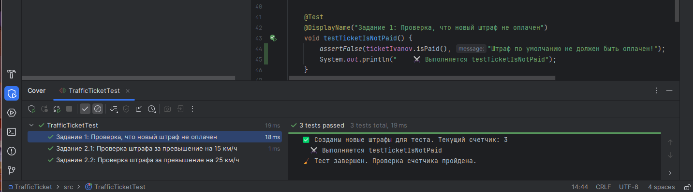
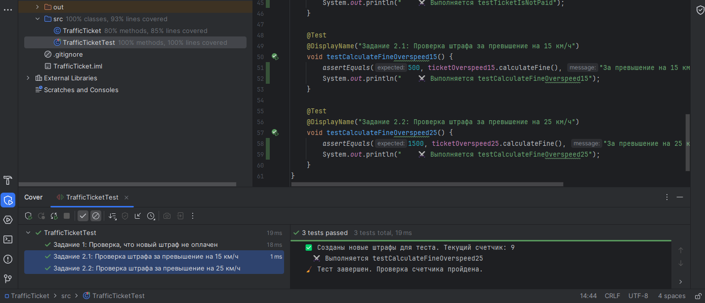
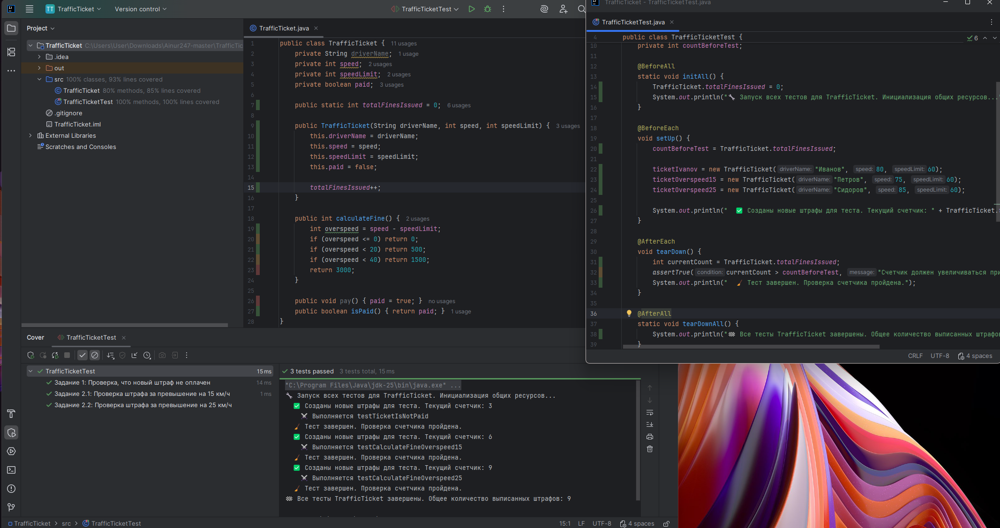
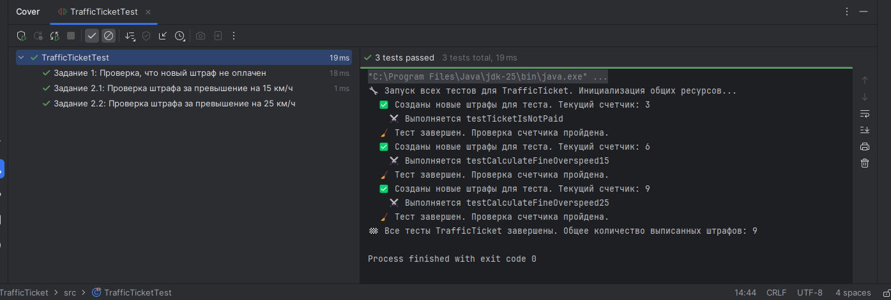
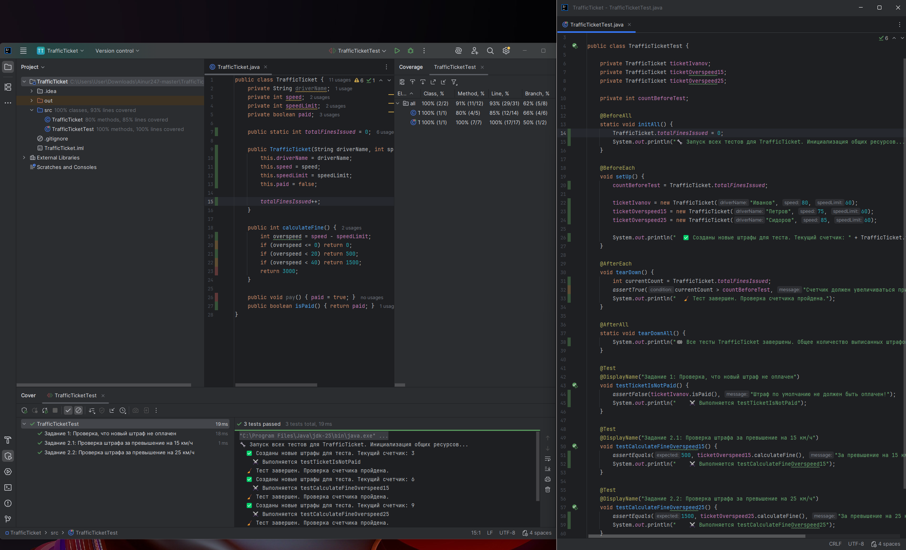

# Лабораторная работа №2_1: Тестовое окружение в JUnit

## 👨‍🎓 Студент
- **ФИО:** Ракипов Айнур Айдарович
- **Группа:** 247
- **Вариант:** 15 Штраф за нарушение ПДД (TrafficTicket)

---

## ✅ Выполненные задания

### Задание 1 (Простое)
**Тест:** Создание штрафа водителю "Иванов" и проверка того, что поле `paid` изначально равно `false` (с использованием `@BeforeEach`).

### Задание 2 (Среднее)
**Тесты:** 
- Расчет штрафа при превышении скорости на 15 км/ч (ожидается 500).
- Расчет штрафа при превышении скорости на 25 км/ч (ожидается 1500).

### Задание 3 (Сложное)
**Тест:** Внедрен статический счетчик `totalFinesIssued`. 
- Инициализация нулем через `@BeforeAll`. 
- Проверка прироста счетчика после каждого создания объектов с помощью `@AfterEach`. 
- Вывод финального количества через `@AfterAll`.

---

## 📊 Результаты

---

## 📎 Ссылки
- [Код тестов](src/test/java/CalculatorTest.java)
- [Основной класс](src/main/java/Calculator.java)

*Дата: 11.03.2026*
